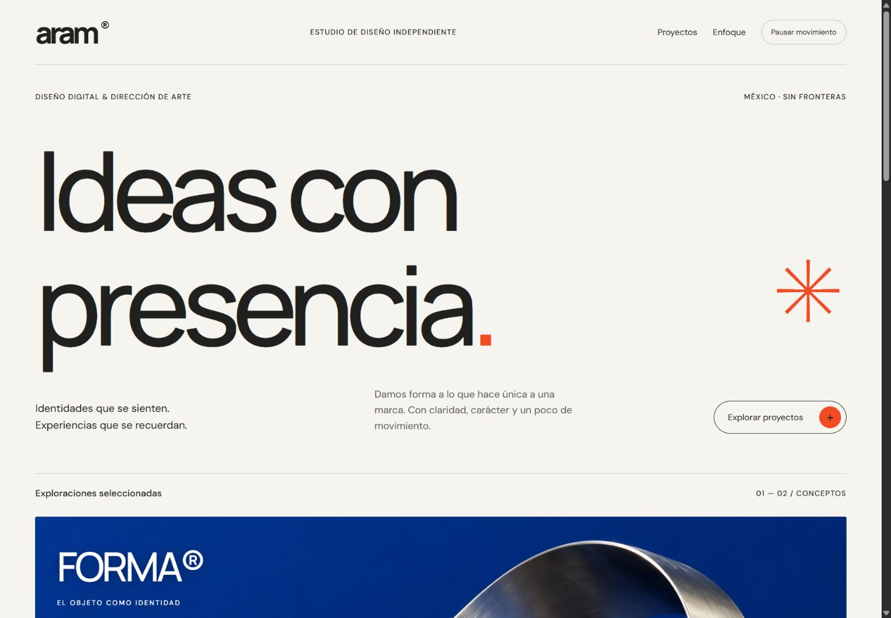
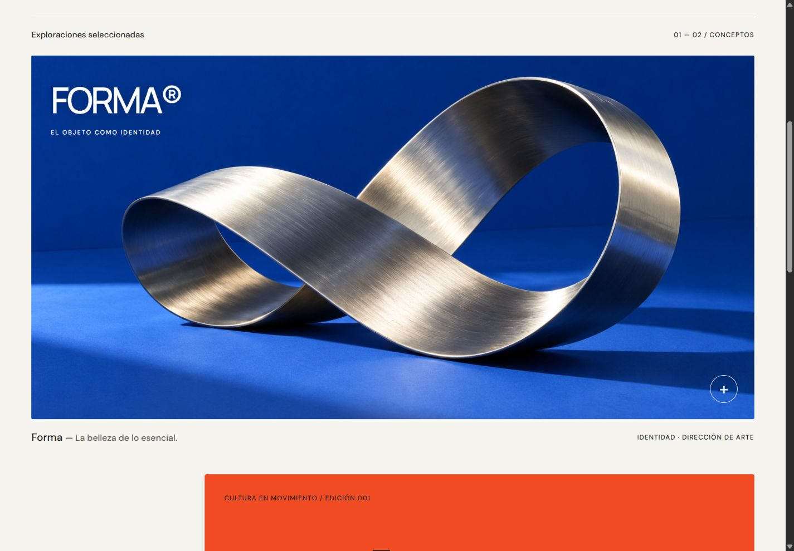
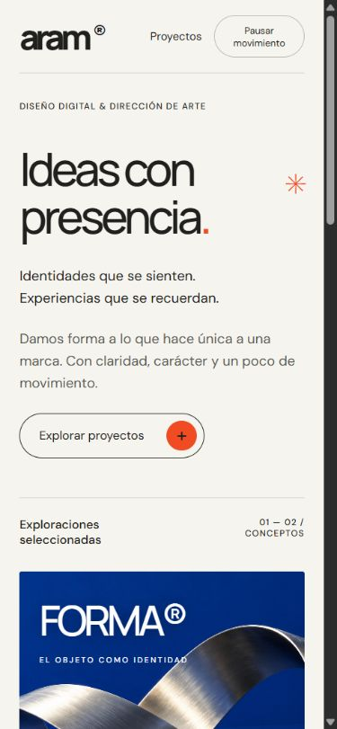

# Aram — Web Design & Motion

Skill de **Aramxz** para crear y pulir páginas con dirección visual propia, tipografía cuidada y movimiento con intención.

Combina principios de [LottieFiles motion-design-skill](https://github.com/LottieFiles/motion-design-skill) con prácticas de [GSAP skills](https://github.com/greensock/gsap-skills), y añade dirección de arte, adaptación móvil y revisión del resultado. Es una síntesis curada, no una copia completa ni un producto oficial de esas organizaciones.

## Así se ve Aram

**Aram Studio** es un ejemplo realizado con esta skill: composición editorial, tipografía protagonista, acentos naranja, arte original y movimiento con GSAP. Los proyectos mostrados son ficticios.

### Escritorio



### Proyectos



### Móvil



Las capturas muestran el ejemplo real; son una referencia de calidad, no una plantilla obligatoria para todas las páginas.

## Criterio visual

Portadas limpias: título sobre la animación, navegación discreta y controles útiles. Sin líneas divisorias decorativas bajo el menú, etiquetas superiores de relleno, coordenadas ficticias ni numeraciones innecesarias.

**Tipografía nítida, composición precisa y efectos con propósito.** Aram evita tipografía neón, glow decorativo, gradientes arbitrarios y combinaciones repetitivas de tarjetas de cristal, halos y sombras exageradas. La identidad nace del contenido, la tipografía y la dirección de arte.

El título principal se prioriza centrado en la portada, también en móvil. Cuando hay animación, el título queda delante de ella en la misma escena, con el movimiento integrado como fondo. Se evitan paletas pastel genéricas de lavanda, rosa empolvado, menta y melocotón: la dirección de color parte de neutros definidos y acentos propios de cada marca.

En diseños futuristas, blanco y negro son la paleta principal, con grises para profundidad y acentos mínimos justificados.

Los colores intensos siguen teniendo lugar: un acento naranja o azul bien utilizado no equivale a una estética neón.

## Instalar

### instalador aram · codex y claude code

Requiere Node.js 20 o posterior y Git. Ejecuta en una terminal interactiva:

```bash
npx --yes --package=github:Aramxz/Aram aram
```

Verás el logo ARAM en letras de bloques con sombra y tonos grises, tu autor y el menú para elegir agente y alcance. Respeta `NO_COLOR` y se adapta a terminales estrechas:

```text
 █████╗ ██████╗  █████╗ ███╗   ███╗
██╔══██╗██╔══██╗██╔══██╗████╗ ████║
███████║██████╔╝███████║██╔████╔██║
██╔══██║██╔══██╗██╔══██║██║╚██╔╝██║
██║  ██║██║  ██║██║  ██║██║ ╚═╝ ██║
╚═╝  ╚═╝╚═╝  ╚═╝╚═╝  ╚═╝╚═╝     ╚═╝

diseño web + movimiento
creado por Aramxz

¿dónde instalar?
  1. codex
  2. claude code
  3. ambos
  0. salir

¿en qué alcance?
  1. global (todos tus proyectos)
  2. proyecto actual
  0. salir
```

También puedes indicar la selección directamente:

```bash
npx --yes --package=github:Aramxz/Aram aram --agent both --scope global
npx --yes --package=github:Aramxz/Aram aram --agent claude-code --scope project
```

`--agent` acepta `codex`, `claude-code` o `both`. `--scope` acepta `global` o `project`. Añade `--dry-run` para ver la selección sin instalar. El instalador delega en `skills` 1.7.0 y no ejecuta comandos de shell construidos con entradas del usuario. Instalar de nuevo puede actualizar la skill existente; conserva aparte tus cambios personales antes de actualizar.

El paquete se obtiene de GitHub; no se ha publicado un paquete npm llamado `aram`. El nombre mostrado es **Aramxz**. En terminales no interactivas se requieren ambas opciones, sin elegir agentes silenciosamente.

### alternativa: cli estándar de skills

```bash
npx skills add Aramxz/Aram --skill aram
```

Para instalar globalmente en Codex:

```bash
npx skills add Aramxz/Aram --skill aram --agent codex --global
```

Para Claude Code, usa `--agent claude-code`; para ambos, `--agent codex claude-code`. La selección interactiva del CLI estándar depende de su detección de entorno. Este comando conserva la interfaz propia de `skills`, sin el banner personalizado de Aram.

La misma carpeta `skills/aram` funciona en ambos agentes. El archivo `agents/openai.yaml` aporta metadatos de Codex y no es necesario para que Claude Code lea `SKILL.md`.

## referencias por categoría

| uso | inspiración |
| --- | --- |
| páginas creativas | [by experience](https://www.byexperience.co.uk/) |
| tiendas | [humanrace](https://humanrace.com/) |
| futurista | [ilab](https://www.ilabsolutions.it/) |
| presentación de proyectos | [smartcafe](https://smart-cafepage.vercel.app/) |

Movimiento: [scroll](https://gsap.com/scroll/), [svg](https://gsap.com/svg/), [texto](https://gsap.com/text/) e [interacciones](https://gsap.com/ui/) de GSAP. Son referencias de inspiración, no plantillas para copiar ni marcas afiliadas.

Cada categoría debe tener una firma de animación propia. Aram prioriza minúsculas en el copy original, conservando grafías obligatorias y datos del usuario. El rendimiento se comprueba con mediciones cuando se afirman mejoras, no por usar una biblioteca.

## Usar

```text
Usa $aram para crear una landing de mi estudio de diseño.
Quiero una estética editorial premium, proyectos protagonistas
y movimiento elegante. Debe funcionar muy bien en móvil.
```

```text
Usa $aram para pulir esta página sin cambiar su identidad.
Revisa composición, tipografía y animaciones, y corrige lo que
impida que se sienta profesional.
```

```text
Usa $aram para añadir una narrativa con GSAP a este portfolio.
Conserva el scroll nativo y prepara una versión sin desplazamientos
para quienes prefieren movimiento reducido.
```

## Versión actual · 0.4.5

- Dirección editorial premium como punto de partida ajustable.
- Criterios de jerarquía, composición, contenido y recursos visuales.
- Movimiento por propósito; CSS, GSAP y Lottie según necesidad.
- Ciclo de vida, limpieza, responsive y ScrollTrigger.
- Revisión de interacción, móvil, teclado y movimiento reducido.
- Criterios explícitos para evitar tipografía neón y decoración genérica.
- Entrada animada del logo al abrir la página, con alternativa estática accesible.
- Títulos de tipografía consistente, sin cambios gratuitos a cursivas.
- Fondos tecnológicos con partículas y conexiones sutiles; más color en redes sociales.
- Animaciones diferenciadas de scroll, SVG, texto e interfaz según cada proyecto.
- Copy original en minúsculas y referencias seleccionadas por categoría.
- Instalador con firma Aramxz y selección de Codex, Claude Code o ambos.

La skill aporta instrucciones reutilizables; no instala automáticamente GSAP, no incluye una web prediseñada y no garantiza puntuaciones de rendimiento. La evolución se basa en páginas reales y feedback concreto.

## Estructura

La skill instalable está en [`skills/aram`](skills/aram/SKILL.md). Sus referencias se consultan solo cuando la tarea las necesita. Los avisos de terceros viajan dentro de esa carpeta para conservar atribución al instalar.

Licencia MIT para esta skill; consulta [LICENSE](LICENSE) y [avisos de terceros](skills/aram/THIRD_PARTY_NOTICES.md).
